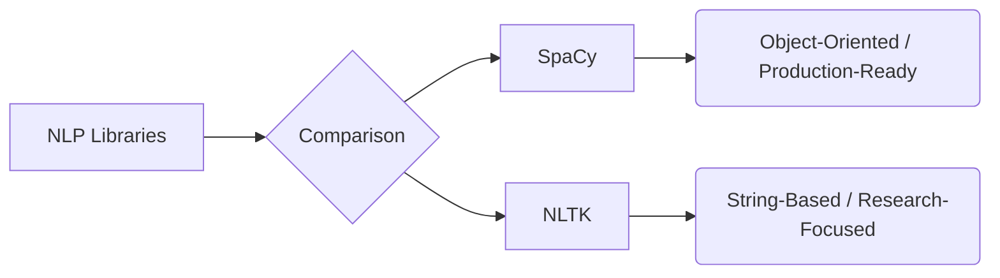

# NLTK vs. SpaCy: A Comparison of NLP Libraries

_Overview Diagram_

### Introduction

NLTK (Natural Language Toolkit) and SpaCy are two of the most popular Python libraries for Natural Language Processing. While they perform many of the same tasks—such as tokenization, stemming, and named entity recognition—they are built with different design philosophies and are suited for different use cases.

### NLTK (Natural Language Toolkit)

- **Philosophy:** NLTK is designed primarily for **research and education**. It is a comprehensive and flexible toolkit that provides a wide array of algorithms and text processing tools.
- **Approach:** It operates primarily on strings. Its structure is more modular, allowing researchers to pick and choose from various implementations for a given task.
- **Strengths:**
  - **Flexibility:** Provides access to numerous algorithms, making it ideal for experimentation and comparing different approaches.
  - **Educational:** It's an excellent tool for learning the underlying concepts of computational linguistics.
  - **Comprehensive:** Contains a vast collection of text processing libraries and lexical resources.
- **Best For:** Researchers, students, and anyone who needs to experiment with or learn about different NLP algorithms.

### SpaCy

- **Philosophy:** SpaCy is designed for **production use**. It is opinionated, meaning it provides what its developers consider the single most efficient and effective algorithm for each task.
- **Approach:** It is object-oriented. When you process text with SpaCy, it creates a `Doc` object that contains rich information and annotations about the text, making it easy to access linguistic features.
- **Strengths:**
  - **Speed and Efficiency:** Optimized for performance, making it suitable for building real-world applications.
  - **Ease of Use:** Its streamlined API and pre-built models make it easy to integrate into applications without needing deep NLP expertise.
  - **Production-Ready:** Comes with integrated word vectors and a focus on building robust NLP pipelines.
- **Best For:** Application developers who need to build NLP-powered features into their products quickly and efficiently.

### Key Differences at a Glance

| Feature         | SpaCy                                 | NLTK                                     |
| :-------------- | :------------------------------------ | :--------------------------------------- |
| **Primary Use** | Production & Application Development  | Research & Education                     |
| **Philosophy**  | Opinionated (provides the "best" way) | Unopinionated (provides many options)    |
| **Approach**    | Object-Oriented (`Doc` objects)       | String-based                             |
| **Speed**       | Fast and optimized for performance    | Generally slower                         |
| **Ease of Use** | High-level, user-friendly API         | Lower-level, requires more customization |
| **Community**   | Modern, active, and growing           | Established, large academic community    |

### Conclusion: Which One Should You Use?

- Choose **SpaCy** if you are building an application and need a fast, reliable, and easy-to-use library for common NLP tasks.
- Choose **NLTK** if you are learning NLP, conducting research, or need the flexibility to experiment with a wide variety of different algorithms.

### Reference

[Spacy vs NLTK: NLP Tutorial For Beginners In Python - S1 E7](https://www.youtube.com/watch?v=h2kBNEShsiE) by [Code Basics](https://www.youtube.com/@codebasics)
