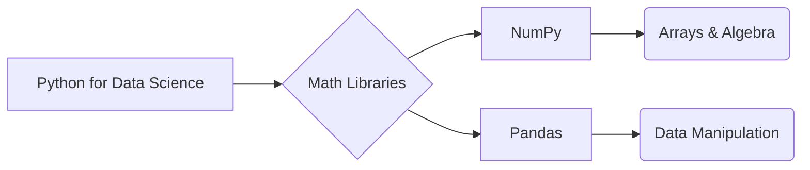

# NumPy vs Pandas

_Overview Diagram_

### Introduction

This note provides a comparison between two fundamental Python libraries for data science: NumPy and Pandas. Both libraries are essential for spotting trends, gaining insights from data, and solving complex numerical problems.

### NumPy

- **Released:** 2005
- **Purpose:** NumPy (Numerical Python) was created to bring efficient scientific computing capabilities to Python.
- **Core Data Structure:** It revolves around the powerful N-dimensional array object (`ndarray`), which provides a fast and memory-efficient way to work with large datasets of numerical data.
- **Strengths:**
  - **Performance:** Leverages low-level libraries like BLAS and LAPACK for high-performance linear algebra and mathematical operations.
  - **Functionality:** Excels at numerical analysis, statistical operations, and simulations. It forms the foundational numerical computing package for many other scientific libraries.

### Pandas

- **Released:** 2008 by Wes McKinney.
- **Purpose:** Pandas was built on top of NumPy to provide a more intuitive and powerful toolset specifically for data manipulation and analysis, particularly for structured or tabular data.
- **Core Data Structures:**
  - **Series:** A one-dimensional labeled array.
  - **DataFrame:** A two-dimensional labeled data structure with columns of potentially different types, much like a spreadsheet or SQL table.
- **Strengths:**
  - **Data Handling:** Provides rich methods for loading, reshaping, pivoting, merging, joining, and cleaning data, including excellent support for handling missing values.
  - **Versatility:** While NumPy focuses on numerical data, Pandas is designed to handle mixed data types (numbers, strings, dates, etc.) seamlessly within a DataFrame.

### Key Differences at a Glance

| Feature         | NumPy                                              | Pandas                                        |
| :-------------- | :------------------------------------------------- | :-------------------------------------------- |
| **Primary Use** | Numerical computing and linear algebra             | Data manipulation and analysis                |
| **Core Object** | `ndarray` (N-dimensional array)                    | `DataFrame` and `Series`                      |
| **Data Types**  | Primarily homogeneous numerical data               | Heterogeneous data (mixed types)              |
| **Focus**       | High-performance mathematical operations on arrays | Flexible data handling and tabular data tools |

### Recommended Approach

A common and effective workflow is to use both libraries together:

1.  Start with **Pandas** for initial data loading, cleaning, and manipulation due to its powerful DataFrame capabilities.
2.  Once the data is prepared, you can extract the underlying numerical data as **NumPy** arrays to perform complex mathematical computations or to feed into machine learning libraries like Scikit-learn, which often expect NumPy arrays as input.

### Reference

[NumPy vs Pandas](https://www.youtube.com/watch?v=KHoEbRH46Zk) by [IBM Technology](https://www.youtube.com/@IBMTechnology)
