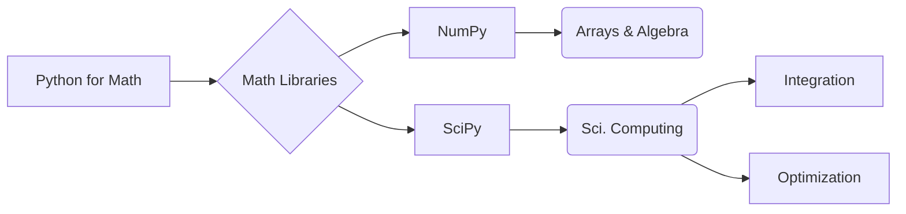

# NumPy vs SciPy

_Overview Diagram_

### Introduction

- This note is a comparison between the NumPy and SciPy mathematical Python Libraries.
- You can use these libraries to do advanced math with code.

### NumPy

- Short for "Numerical Python."
- It is the fundamental package for scientific computing in Python, providing support for large, multi-dimensional arrays and matrices.
- It allows you to perform highly efficient operations on these arrays as if they were single numbers.
- The core data structure is the `ndarray` (n-dimensional array), a grid of values of the same type.
- **Functions:**
  - Basic mathematical operations (addition, subtraction, element-wise multiplication).
  - Linear algebra, Fourier transforms, and random number capabilities.

- **Use Cases:**
  - Foundation for other data science libraries (like Pandas and SciPy itself).
  - 3-D graphics modeling.
  - Machine learning data manipulation.
  - Statistical analysis.

### SciPy

- Short for "Scientific Python."
- SciPy is built on top of NumPy, leveraging `ndarray` objects to provide a vast collection of user-friendly and efficient numerical routines.
- It contains more sophisticated, higher-level algorithms for scientific and technical computing.

- **Functions:**
  - Numerical integration and optimization.
  - Signal and image processing.
  - Statistics and probability distributions.
  - Advanced linear algebra.
  - Interpolation, such as cubic spline interpolation.

### Efficiency

- Both NumPy and SciPy are highly efficient. They are written in C and Fortran under the hood, which allows them to execute complex mathematical operations much faster than native Python code.

### Reference

[NumPy vs SciPy](https://www.youtube.com/watch?v=l3s-_8uTBVA) by [IBM Technology](https://www.youtube.com/@IBMTechnology)
